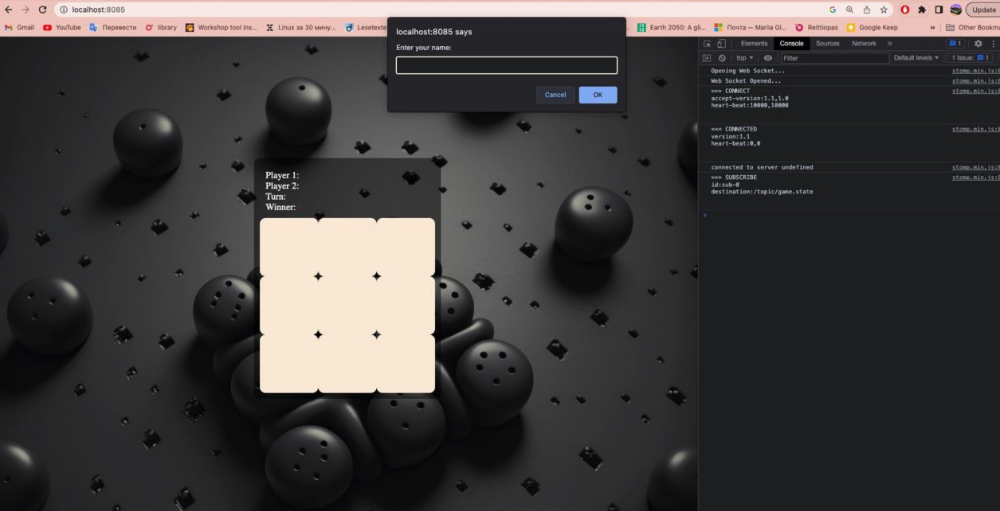

# Tic-Tac-Toe Multiplayer Game

Welcome to the Tic-Tac-Toe Multiplayer Game project! This project is a simple yet fun implementation of the classic Tic-Tac-Toe game using Java for the backend and HTML with a static frontend. It supports multiplayer gameplay using WebSockets (Stomp.js).

## Table of Contents

- [Features](#features)
- [Technologies](#technologies)
- [Prerequisites](#prerequisites)
- [Getting Started](#getting-started)
- [Project Structure](#project-structure)
- [How to Play](#how-to-play)
- [Contributing](#contributing)
- [License](#license)

## Features

- Multiplayer gameplay: Play against another player in real-time.
- WebSockets (Stomp.js): Enables real-time communication between players.
- Simple and clean frontend: The HTML-based frontend is easy to understand and modify.
- Java Spring Boot backend: Provides a robust and scalable server for handling game logic.
- RESTful API: Allows for future expansion or integration with other services.
- Extensible: You can build upon this project for more complex features.

## Technologies

- Java Spring Boot: For the backend server.
- HTML: For the static frontend.
- WebSockets with Stomp.js: Real-time communication.
- Maven: For dependency management and building.
- Git: Version control.

## Prerequisites

Before you begin, ensure you have met the following requirements:

- Java Development Kit (JDK) 8 or higher.
- Maven installed.
- A modern web browser with WebSocket support.

## Getting Started

Follow these steps to get your Tic-Tac-Toe game up and running:

1. Clone the repository:

```bash
git clone https://github.com/yourusername/tic-tac-toe.git
```

2. Navigate to the backend directory:

```bash
cd tic-tac-toe-backend
```

3. Build and run the Java Spring Boot application:

```bash
mvn spring-boot:run
```

4. Open a web browser and navigate to `http://localhost:8080` to access the game.

## Project Structure

- `src/main/java`: Contains the Java source code for the Spring Boot backend.
- `src/main/resources`: Contains application properties and templates.
- `src/main/webapp`: Contains the static HTML frontend.
- `src/main/resources/static`: Contains CSS and JavaScript resources for the frontend.

## How to Play

1. Open the game in two different browser tabs or devices.
2. One player will be X, and the other player will be O.
3. Make moves by clicking on the empty squares on the board.
4. The game will display the winner or a draw when the game is over.

## Contributing

We welcome contributions! If you'd like to enhance this project or report issues, please follow these steps:

1. Fork the project and create your feature branch.

2. Make your changes and commit them.

3. Push to the origin repository.

4. Create a pull request with a detailed description of your changes.

## License

This project is licensed under the MIT License - see the [LICENSE](LICENSE) file for details.

Enjoy your Tic-Tac-Toe multiplayer game! If you have any questions or need assistance, feel free to contact us.


